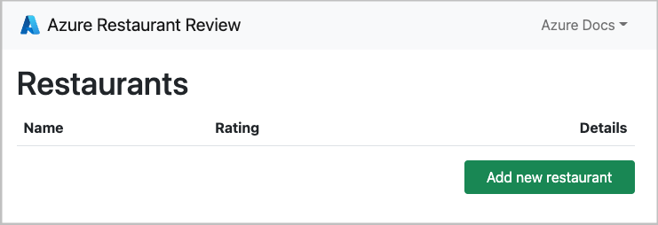

<!-- YAML front-matter schema: https://review.learn.microsoft.com/en-us/help/contribute/samples/process/onboarding?branch=main#supported-metadata-fields-for-readmemd -->

# Deploy a Python (Flask) web app with PostgreSQL in Azure

This is a Python web app using the Flask framework and the Azure Database for PostgreSQL relational database service. The Flask app is hosted in a fully managed Azure App Service. This app is designed to be be run locally and then deployed to Azure. You can either deploy this project by following the tutorial [*Deploy a Python (Django or Flask) web app with PostgreSQL in Azure*](https://docs.microsoft.com/azure/app-service/tutorial-python-postgresql-app) or by using the [Azure Developer CLI (azd)](https://learn.microsoft.com/azure/developer/azure-developer-cli/overview) according to the instructions below.

## Requirements

The [requirements.txt](./requirements.txt) has the following packages, all used by a typical data-driven Flask application:

| Package | Description |
| ------- | ----------- |
| [Flask](https://pypi.org/project/Flask/) | Web application framework. |
| [SQLAlchemy](https://pypi.org/project/SQLAlchemy/) | Provides a database abstraction layer to communicate with PostgreSQL. |
| [Flask-SQLAlchemy](https://pypi.org/project/Flask-SQLAlchemy/) | Adds SQLAlchemy support to Flask application by simplifying using SQLAlchemy. Requires SQLAlchemy. |
| [Flask-Migrate](https://pypi.org/project/Flask-Migrate/) | SQLAlchemy database migrations for Flask applications using Alembic. Allows functionality parity with Django version of this sample app.|
| [pyscopg2](https://pypi.org/project/psycopg2/) | PostgreSQL database adapter for Python. |
| [python-dotenv](https://pypi.org/project/python-dotenv/) | Read key-value pairs from .env file and set them as environment variables. In this sample app, those variables describe how to connect to the database locally. <br><br> Flask's [dotenv support](https://flask.palletsprojects.com/en/2.1.x/cli/#environment-variables-from-dotenv) sets environment variables automatically from an `.env` file. |
| [flask_wtf](https://pypi.org/project/Flask-WTF/) | Form rendering, validation, and CSRF protection for Flask with WTForms. Uses CSRFProtect extension. |

## Run the sample

This project has a [dev container configuration](.devcontainer/), which makes it easier to develop apps locally, deploy them to Azure, and monitor them. The easiest way to run this sample application is inside a GitHub codespace. Follow these steps:

1. Fork this repository to your account. For instructions, see [Fork a repo](https://docs.github.com/get-started/quickstart/fork-a-repo).

1. From the repository root of your fork, select **Code** > **Codespaces** > **+**.

1. In the codespace terminal, run the following commands:

    ```shell
    # Install requirements
    python3 -m pip install -r requirements.txt
    # Create .env with environment variables
    cp .env.sample.devcontainer .env
    # Run database migrations
    python3 -m flask db upgrade
    # Start the development server
    python3 -m flask run
    ```

1. When you see the message `Your application running on port 8000 is available.`, click **Open in Browser**.

### Quick deploy

This project is designed to work well with the [Azure Developer CLI](https://learn.microsoft.com/azure/developer/azure-developer-cli/overview), which makes it easier to develop apps locally, deploy them to Azure, and monitor them. 

🎥 Watch a deployment of the code in [this screencast](https://www
.youtube.com/watch?v=JDlZ4TgPKYc).

Steps for deployment:

1. Sign up for a [free Azure account](https://azure.microsoft.com/free/)
2. Install the [Azure Dev CLI](https://learn.microsoft.com/azure/developer/azure-developer-cli/install-azd). (If you opened this repository in a Dev Container, it's already installed for you.)
3. Initialize a new `azd` environment:

    ```shell
    azd init
    ```

    It will prompt you to provide a name (like "flask-app"), which will later be used in the name of the deployed resources.

4. Provision and deploy all the resources:

    ```shell
    azd up
    ```

    It will prompt you to login, pick a subscription, and provide a location (like "eastus"). Then it will provision the resources in your account and deploy the latest code. If you get an error with deployment, changing the location (like to "centralus") can help, as there may be availability constraints for some of the resources.

5. When `azd` has finished deploying, you'll see an endpoint URI in the command output. Visit that URI, and you should see the front page of the restaurant review app! 🎉 If you see an error, open the Azure Portal from the URL in the command output, navigate to the App Service, select Logstream, and check the logs for any errors.

    

6. When you've made any changes to the app code, you can just run:

    ```shell
    azd deploy
    ```

## Getting help

If you're working with this project and running into issues, please post in [Issues](/issues).
